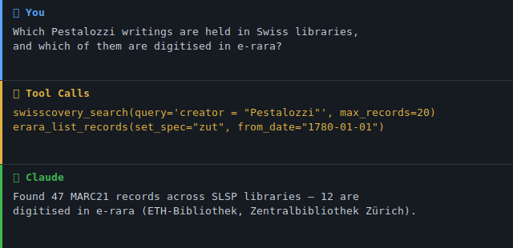

> 🇨🇭 **Part of the [Swiss Public Data MCP Portfolio](https://github.com/malkreide)**

# 📚 swiss-academic-libraries-mcp

[](https://pypi.org/project/swiss-academic-libraries-mcp/)
[](https://opensource.org/licenses/MIT)
[](https://www.python.org/downloads/)
[](https://modelcontextprotocol.io/)
[](https://github.com/malkreide/swiss-academic-libraries-mcp)


> MCP server providing access to Swiss academic libraries — swisscovery, e-rara, e-periodica, e-manuscripta. No API key required.

[🇩🇪 Deutsche Version](README.de.md)

### Demo



---

## Overview

**swiss-academic-libraries-mcp** connects AI models to the full Swiss academic library infrastructure via standardised, open protocols. It covers the [swisscovery](https://swisscovery.slsp.ch) union catalogue (500+ libraries, 10M+ records) and three digitalisation platforms: historical prints ([e-rara](https://www.e-rara.ch)), periodicals ([e-periodica](https://www.e-periodica.ch)) and manuscripts ([e-manuscripta](https://www.e-manuscripta.ch)).

All data sources use open, authentication-free protocols (SRU/MARC21, OAI-PMH/Dublin Core). The server supports both local use via Claude Desktop (stdio transport) and cloud deployment (Streamable HTTP).

Beyond the catalogue, the server also covers **Swiss open-access legal literature** — freely readable legal scholarship from [sui generis](https://sui-generis.ch), [ex/ante](https://ex-ante.ch) and [Repositorium.ch](https://www.repositorium.ch) — as **metadata** (title, authorship, year, licence, DOI, link), never full text.

It also adds the **international metadata layer**: DOI resolution and international research literature via [Crossref](https://www.crossref.org), and preprints via [arXiv](https://arxiv.org). This lets one conversation answer both *"is this held in Switzerland?"* (national layer) and *"what is this, and where else does it live?"* (international layer). Every resolved DOI returns title, ISSN, ISBN and authors as clean top-level fields, so you can pivot straight into swisscovery.

**Anchor demo query (national ↔ international):** *"Find the original publication for this DOI, check whether a preprint version exists, and show whether a Swiss library holds it."* → `resolve_doi` → `search_preprints` → `swisscovery_search(query="<ISSN from resolve_doi>")`.

**Anchor demo query (catalogue):** *"Which Swiss university dissertations on primary school pedagogy are held in Swiss libraries, and are any of them digitised in e-rara?"*

**Anchor demo query (OA legal literature):** *"Which freely accessible legal-scholarship articles exist on data protection in education? Give me title, authorship, year, licence and DOI."* → `oa_law_search(query="Datenschutz im Bildungsbereich")` — results are ranked by relevance: articles matching **all** terms rank first, articles matching only the core term (`Datenschutz`) follow, so the query returns the real privacy-law corpus rather than an empty set.

---

## Features

- **16 tools** across 4 catalogue sources + 3 open-access legal-literature sources + 2 international metadata sources — all read-only, no API key required
- **swisscovery search** with full CQL syntax: full-text, title, author, subject, ISBN/ISSN
- **OAI-PMH harvesting** with date range and collection filters plus pagination via resumption tokens
- **MARC21 parser** extracting 20+ fields (title, creator, publication info, subjects, abstract, URLs)
- **Dublin Core parser** for all three digitalisation portals
- **Dual transport**: stdio for Claude Desktop · Streamable HTTP for cloud/self-hosted deployments
- **OA legal-literature search** across sui generis, ex/ante and Repositorium.ch with a declarative source registry (new sources = one config entry), best-effort Crossref licence enrichment, and graceful per-source degradation
- **International metadata layer**: DOI resolution and bibliographic search via Crossref (polite pool via `CROSSREF_MAILTO`), preprint search via arXiv with automatic phrase quoting and request throttling — clean title/ISSN/ISBN/author fields for pivoting into swisscovery
- **3 built-in prompts**: `research-workflow`, `education-research` and `doi-to-swiss-shelf`
- **Markdown and JSON output** for all tools
- **97 unit/mocked tests** (no network) + 30 live smoke tests

---

## Data Sources

| Source | Protocol | Content | Records |
|--------|----------|---------|---------|
| [swisscovery (SLSP)](https://swisscovery.slsp.ch) | SRU / MARC21 | 500+ Swiss libraries | 10M+ |
| [e-rara](https://www.e-rara.ch) | OAI-PMH / Dublin Core | Digitised historical prints | 250k+ |
| [e-periodica](https://www.e-periodica.ch) | OAI-PMH / Dublin Core | Digitised periodicals (1750–today) | 1M+ articles |
| [e-manuscripta](https://www.e-manuscripta.ch) | OAI-PMH / Dublin Core | Manuscripts & archival material | 100k+ |

### Open-Access legal literature (metadata only)

| Source | Protocol | Content | DOI coverage |
|--------|----------|---------|--------------|
| [sui generis](https://sui-generis.ch) | OAI-PMH / Dublin Core | OA legal journal & non-profit publisher | ~100 % (`10.21257/…`) |
| [ex/ante](https://ex-ante.ch) | OAI-PMH / Dublin Core | Peer-reviewed journal for (young) legal scholarship, multilingual | none (persistent URL) |
| [Repositorium.ch](https://www.repositorium.ch) | Supabase / PostgREST (JSON) | Subject repository for Swiss law | partial |

### International metadata layer (metadata only)

| Source | Protocol | Content | Licence |
|--------|----------|---------|---------|
| [Crossref](https://www.crossref.org) | REST / JSON | DOI resolution + international research literature | Metadata CC0 1.0 (public domain) |
| [arXiv](https://arxiv.org) | Atom / XML | Preprints (CS, physics, maths, stats, …) | Metadata CC0 1.0; preprints per author licence |

---

## Tools

| Tool | Source | Function |
|------|--------|----------|
| `library_info` | — | Entry point: overview of all sources and tools |
| `swisscovery_search` | swisscovery | Full-text / CQL search across the union catalogue |
| `swisscovery_get_record` | swisscovery | Single record by MMS-ID |
| `erara_list_records` | e-rara | Prints filtered by date / collection |
| `erara_get_record` | e-rara | Single item by OAI identifier |
| `erara_list_collections` | e-rara | All participating libraries |
| `eperiodica_list_records` | e-periodica | Articles filtered by date |
| `eperiodica_get_record` | e-periodica | Single article by OAI identifier |
| `emanuscripta_list_records` | e-manuscripta | Manuscripts filtered by date / collection |
| `emanuscripta_get_record` | e-manuscripta | Single object by OAI identifier |
| `emanuscripta_list_collections` | e-manuscripta | All archives / collections |
| `oa_law_search` | OA legal (all 3) | Search OA legal scholarship (title/abstract/author) with source, language, year and peer-review filters |
| `oa_law_get` | OA legal (all 3) | Single OA legal article by DOI or resolvable URL |
| `resolve_doi` | Crossref | Resolve a DOI to full metadata (title/ISSN/ISBN/authors → pivot into swisscovery) |
| `search_publications` | Crossref | Search international research literature; every hit carries a DOI |
| `search_preprints` | arXiv | Search preprints with automatic phrase quoting; linked journal DOIs bridge to `resolve_doi` |

### Example Use Cases

| Query | Tool |
|-------|------|
| *"Which books about Swiss primary schools are held in Swiss libraries?"* | `swisscovery_search` |
| *"Show digitised historical works from ETH Library"* | `erara_list_records` |
| *"Which Swiss periodicals were digitised in 2023?"* | `eperiodica_list_records` |
| *"What manuscript collections does e-manuscripta hold?"* | `emanuscripta_list_collections` |
| *"Which OA legal articles exist on facial recognition?"* | `oa_law_search` |
| *"Resolve DOI 10.1038/nature14539 and give me its ISSN"* | `resolve_doi` |
| *"Find recent preprints on model context protocol"* | `search_preprints` |
| *"Find this paper's DOI, check for a preprint, and see if a Swiss library holds it"* | `resolve_doi` → `search_preprints` → `swisscovery_search` |

---

## Architecture

Three independent paths share one HTTP client (retry with exponential backoff, shared connection pool, project `User-Agent`):

```
                    ┌──────────────────────────────────────────────────────┐
                    │            swiss-academic-libraries-mcp               │
                    │            (FastMCP · stdio / HTTP)                   │
                    └────────┬───────────────┬────────────────┬────────────┘
                             │               │                │
          ┌── CATALOGUE ─────┘   ┌── OA-LEGAL ┘     ┌── INTERNATIONAL ──┐
          │   (api_client.py)    │   (oa_legal.py)  │  (intl_metadata.py)│
          │                      │                  │                    │
 ┌────────┴────────┐   ┌─────────┴──────────┐   ┌───┴──────────────────┐ │
 │ swisscovery SRU │   │ source registry     │   │ Crossref  REST/JSON  │ │
 │ e-rara      OAI │   │  ├ sui generis  OAI │   │  ├ resolve_doi        │ │
 │ e-periodica OAI │   │  ├ ex/ante      OAI │   │  └ search_publications│ │
 │ e-manuscripta   │   │  └ Repositorium REST│   │ arXiv     Atom/XML   │ │
 └────────┬────────┘   │ harvest→cache→filter│   │  └ search_preprints   │ │
          │            │ Crossref licence ⟳  │   │ (phrase-quote+throttle)│ │
 MARC21 / Dublin Core  └─────────┬──────────┘   └───┬──────────────────┘ │
 → catalogue records   OaLegalPublication         CrossrefWork / Preprint │
                       (metadata, no full text)   (metadata, no full text) │
```

- **Catalogue path** returns bibliographic records (books, digitised prints, periodicals, manuscripts).
- **OA-legal path** harvests OA legal-scholarship metadata once, caches it in memory (small corpus), and filters locally — because OAI-PMH has no keyword search of its own. Adding a fourth OA source is a single registry entry, not new code.
- **International path** resolves DOIs and searches Crossref/arXiv live (Architecture A — the endpoints are small, stable and public, so no dump/cache is needed). Each response carries its **own source attribution** (Crossref CC0 · arXiv acknowledgement), never a pooled one, and returns clean top-level title/ISSN/ISBN/author fields so the model can pivot into the catalogue path. A code-layer egress allow-list restricts outbound calls to `api.crossref.org` and `export.arxiv.org`.

---

## Licensing & Scope

This server is deliberately conservative about what it emits — a portfolio that treats governance as a feature cannot be careless here.

- **Metadata, not full text.** For OA legal literature the server returns **title, authorship, year, licence, DOI/link and — where the source provides it as a metadatum — the abstract**. It never ingests, stores, or outputs the article body. The full-text PDF path exposed by Repositorium.ch is intentionally *not* carried into any field.
- **`licence` is always set.** Open Access means *free to read*, **not** *free to reuse*. Licences range from CC0 and CC BY to CC BY-NC-ND, and some articles are simply "free to read" with no open licence at all. When no machine-readable licence is available, the field is `"unknown"` — never guessed, never omitted. The native OAI metadata of all three sources carries only copyright statements, so `"unknown"` is the default; a best-effort **Crossref** lookup upgrades it to the real CC licence where a DOI resolves (e.g. sui generis → `CC BY-SA 4.0`). Disable with `OA_LAW_CROSSREF_ENRICH=0`.
- **Citation integrity.** Every result carries a resolvable reference — a DOI where present, otherwise a persistent URL. No result is emitted without one. A fabricated citation in legal literature is worse than no citation, so the server prefers one hit fewer over one hit invented.
- **Language is carried, never silently filtered.** ex/ante and Repositorium.ch are multilingual (DE/FR/IT/EN). The `language` field is always populated, but results are only filtered by language when you explicitly ask — otherwise half the Romandie would vanish from the results.
- **Attribution per source, not pooled.** Crossref, arXiv and the OA-legal sources have different licence and citation conditions, so each response carries the attribution of the source it actually came from. Crossref bibliographic metadata is distributed under **CC0 1.0** (facts are free); arXiv metadata is **CC0 1.0** with the requested acknowledgement *"Thank you to arXiv for use of its open access interoperability"*; preprint and article full texts remain under their own per-work licences (never emitted here).
- **Scope boundary.** OA legal literature belongs here because it is the *same capability* already in this server — authentication-free bibliographic-metadata harvesting of Swiss scholarly sources over standard protocols — with the same output contract (metadata, not full text). It is institution-independent and subject-focused, which is why it does **not** overlap [`eth-library-mcp`](https://github.com/malkreide/eth-library-mcp) (ETH-institution Discovery & Persons) — the catalogue finds the *book*, the OA-legal path finds the freely readable *article* with its licence and DOI.

---

## Known Limitations

- **Small, focused corpus.** The three OA sources together hold on the order of a few hundred articles. Results are ranked by relevance — articles matching all query terms first, then partial matches — so a topical query like *"Datenschutz im Bildungsbereich"* returns the privacy-law corpus (ranked) rather than nothing; if no article covers the full topic intersection, the closest real matches are returned, never a fabricated one. A query that matches no term at all still returns an honest empty result.
- **No full-text search.** Matching runs over metadata (title, abstract, authorship) only — never the article body.
- **Uneven DOI coverage.** sui generis ≈ 100 %, Repositorium.ch partial, ex/ante has **no DOIs** (persistent URLs only). Aggregators (Crossref/OpenAlex) therefore cover sui generis well but miss ex/ante entirely and do not index Repositorium.ch as a source — which is why the server harvests each source natively rather than relying on an aggregator.
- **Licence gaps.** The native metadata rarely carries a machine-readable licence; `"unknown"` is common and only lifted where a DOI resolves in Crossref.
- **Not a substitute for a paid legal database.** This surfaces *freely accessible* Swiss legal scholarship only — it is not Swisslex/Weblaw and does not cover commercial or paywalled legal publishing.

### Known findings — international layer (live probe 2026-07-20)

| Finding | Detail | Consequence |
|---|---|---|
| **Crossref is weak for German-language CH education literature** | `query.bibliographic=Lehrplan 21` returns a **book chapter from 1881** as the top hit; other CH-education queries surface millions of irrelevant results with off-topic/old top hits. Crossref is strong for DOI resolution and international research, not for CH education publishing. | `search_publications` documents this and points to `swisscovery_search` / `oa_law_search` for CH education topics. |
| **arXiv treats spaces as OR, not phrase** | `all:model context protocol` → ~1,296,686 hits (OR); `all:"model context protocol"` → 462 hits (phrase). | `search_preprints` quotes the query automatically; users need no arXiv syntax. Field syntax (`ti:`, `au:`) and explicit quotes are respected. |
| **arXiv returns Atom XML, throttles, and 301-redirects `http`→`https`** | Response is Atom, not JSON; arXiv asks for ~3 s between requests; the plain `http://` endpoint 301-redirects. | Parser reuses `defusedxml` (already a dependency — no new one); a module-level throttle (`ARXIV_MIN_INTERVAL_SECONDS`, default 3 s) enforces spacing; the client calls the `https://` endpoint directly. |
| **SHARE (share.osf.io) — evaluated, not built** | The `_search` endpoint responds (≈58.9 M records, Elasticsearch-style), **but** SHARE wound down harvesting in 2020, archived its database in CurateND, and carries no API-maintenance commitment ("shutting down / new phase", now the "trove" search-api). For a portfolio positioned on reliability, an index without a support guarantee is a poor dependency. | **Not implemented.** |
| **Open Library — evaluated, gate failed** | A 10-ISBN probe of real Swiss/German-language Lehrmittel (Lehrmittelverlag Zürich, Klett und Balmer; ISBNs harvested from swisscovery) returned **0/10 = 0 %** (threshold 60 %). Controls confirm Open Library works (English + mainstream German trade books resolve), so it is a genuine coverage gap, not a connectivity artefact. | **Not implemented.** swisscovery already covers CH Lehrmittel; for the book trade, GVI or a publisher directory is the fitting route. |

---

## Prerequisites

- Python 3.11 or higher
- [uv](https://docs.astral.sh/uv/) / uvx (recommended) or pip
- Internet access (all APIs are publicly available)

---

## Installation

### Claude Desktop (recommended)

Add to `claude_desktop_config.json`:

**macOS:** `~/Library/Application Support/Claude/claude_desktop_config.json`  
**Windows:** `%APPDATA%\Claude\claude_desktop_config.json`

```json
{
  "mcpServers": {
    "swiss-academic-libraries": {
      "command": "uvx",
      "args": ["swiss-academic-libraries-mcp"]
    }
  }
}
```

Restart Claude Desktop — the server starts automatically on first use.

### Cloud / Self-hosted (Streamable HTTP)

```bash
uvx swiss-academic-libraries-mcp --http --port 8000 [--host 127.0.0.1]
```

**Security & Deployment Notes**

- **Default binding is `127.0.0.1`** (loopback only). The server has no
  built-in authentication.
- Use `--host 0.0.0.0` only when running **behind a reverse proxy that
  provides authentication and per-IP rate limits** (e.g. nginx with
  `limit_req` + OAuth2-Proxy). Non-loopback bindings emit a WARN log.
- Logs go to **stderr**; set verbosity with `MCP_LOG_LEVEL=DEBUG|INFO|WARNING`.

### Development

```bash
git clone https://github.com/malkreide/swiss-academic-libraries-mcp
cd swiss-academic-libraries-mcp
pip install -e .
```

---

## Quickstart

Start by calling `library_info` for a full overview. Then:

```
"Which books about Swiss primary schools are held in Swiss libraries?"
→ swisscovery_search(query='subject = "Volksschule"', max_records=20)

"Show digitised historical works from ETH Library"
→ erara_list_records(set_spec="zut")

"Which Swiss periodicals were digitised in 2023?"
→ eperiodica_list_records(from_date="2023-01-01", until_date="2023-12-31")

"What manuscript collections does e-manuscripta hold?"
→ emanuscripta_list_collections()

→ [More use cases by audience](EXAMPLES.md) →
```

> 💡 *"No API key — just install and query."*

### CQL Search Syntax (swisscovery)

```
Full text:     Volksschule Zürich
Title:         title = "education reform"
Author:        creator = "Pestalozzi"
Subject:       subject = "pedagogy"
ISBN:          isbn = "978-3-05-006234-0"
Combined:      title = "school" AND creator = "Pestalozzi"
Pagination:    start_record = 11
```

---

## Configuration

No API keys required. All environment variables are optional.

| Parameter | Default | Description |
|-----------|---------|-------------|
| `--http` | off | Enable Streamable HTTP transport |
| `--port` | 8000 | Port for HTTP transport |
| `MCP_LOG_LEVEL` | `INFO` | Log verbosity (`DEBUG`/`INFO`/`WARNING`) |
| `OA_LAW_CROSSREF_ENRICH` | `1` | OA legal: DOI→licence enrichment via Crossref; set `0` to disable |
| `OA_LAW_REPOSITORIUM_ANON_KEY` | *(public key)* | OA legal: override for Repositorium.ch's public read-only Supabase anon key (allows rotation without a code change) |
| `CROSSREF_MAILTO` | *(unset)* | International: contact e-mail for Crossref's "polite pool" (better throughput). If unset, requests use the anonymous pool — functional, just slower. |
| `ARXIV_MIN_INTERVAL_SECONDS` | `3.0` | International: minimum spacing between arXiv requests (arXiv asks for restraint). |

---

## Project Structure

```
swiss-academic-libraries-mcp/
├── src/
│   └── swiss_academic_libraries_mcp/
│       ├── __init__.py       # Package init
│       ├── server.py         # FastMCP server, 16 tools, 3 prompts, 3 resources
│       ├── api_client.py     # HTTP client (+ retry), MARC21 + OAI-PMH/DC parsers
│       ├── oa_legal.py       # OA legal-literature registry, adapters, model
│       └── intl_metadata.py  # International layer: Crossref + arXiv adapters, models
├── tests/
│   ├── test_server.py        # catalogue unit tests + live smoke tests
│   ├── test_20_scenarios.py  # end-to-end catalogue scenarios
│   ├── test_oa_legal.py      # OA legal-literature tests (mocked + live)
│   └── test_intl_metadata.py # International-layer tests (mocked + live)
├── pyproject.toml
├── CHANGELOG.md
├── CONTRIBUTING.md            # Contributing guide (English)
├── CONTRIBUTING.de.md         # Contributing guide (German)
├── SECURITY.md               # Security policy (English)
├── SECURITY.de.md            # Security policy (German)
├── LICENSE
├── README.md                 # This file (English)
└── README.de.md              # German version
```

---

## Testing

```bash
# Unit tests (no network required)
PYTHONPATH=src pytest tests/ -m "not live"

# Live smoke tests (internet required)
PYTHONPATH=src pytest tests/ -m "live"
```

---

## Safety & Limits

- **Read-only:** All tools perform HTTP GET requests against public SRU and OAI-PMH endpoints — no data is written, modified, or deleted.
- **No personal data:** The APIs return bibliographic metadata (titles, authors, publication info, subject headings) and public digitisation records. No personally identifiable information (PII) about library users is processed or stored.
- **Rate limits:** swisscovery SRU and the OAI-PMH endpoints are public and have no documented hard limits, but OAI-PMH harvesting is paginated via resumption tokens — use `from_date` / `until_date` and keep `max_records` reasonable. The server enforces a 30s timeout per request.
- **Data freshness:** Results reflect the upstream catalogues at query time. No caching is performed by this server; indexing latency is controlled by SLSP and the digitisation platforms.
- **Terms of service:** Data is subject to the ToS and licences of each source — [swisscovery / SLSP](https://slsp.ch), [e-rara](https://www.e-rara.ch), [e-periodica](https://www.e-periodica.ch), [e-manuscripta](https://www.e-manuscripta.ch). Most digitised material is in the public domain or under Creative Commons licences; always check the rights statement on the individual record before redistribution.
- **No guarantees:** This is a community project, not affiliated with SLSP, ETH Library, or any of the participating institutions. Availability depends on the upstream APIs.

---

## Contributing

Contributions are welcome! Please read [CONTRIBUTING.md](CONTRIBUTING.md) for guidelines on:

- Reporting bugs and requesting features
- Setting up the development environment
- Code style and test requirements
- Submitting pull requests

This project follows the conventions of the [Swiss Public Data MCP Portfolio](https://github.com/malkreide).

---

## Security

To report a vulnerability, please follow the responsible disclosure process in [SECURITY.md](SECURITY.md). The server is read-only and requires no API key; see the *Safety & Limits* section above for the security model.

---

## Changelog

See [CHANGELOG.md](CHANGELOG.md)

---

## Deployment for Swiss Public Administration

If you self-host this server for a Swiss school authority, archive,
or municipal use case:

- **Data residency:** prefer on-premise or a CH-based cloud provider.
  The query patterns themselves (which library searches a civil
  servant runs) may reveal ongoing research and are best kept on
  Swiss infrastructure.
- **Upstream calls** go exclusively to CH-hosted services: SLSP /
  swisscovery, ETH-Bibliothek (e-rara, e-periodica, e-manuscripta).
  No data leaves Switzerland.
- **Logging:** logs are written to stderr; configure your IT
  retention policy accordingly (e.g. systemd-journal `MaxRetentionSec`).
- **HTTP transport** must run behind a reverse proxy with
  authentication and per-IP rate limits (see *Security & Deployment
  Notes* above).

---

## License

MIT License — see [LICENSE](LICENSE)

---

## Author

Hayal Oezkan · [github.com/malkreide](https://github.com/malkreide)

---

## Credits & Related Projects

- **Data (catalogue):** [swisscovery / SLSP](https://swisscovery.slsp.ch) · [e-rara](https://www.e-rara.ch) · [e-periodica](https://www.e-periodica.ch) · [e-manuscripta](https://www.e-manuscripta.ch)
- **Data (OA legal literature):** [sui generis](https://sui-generis.ch) · [ex/ante](https://ex-ante.ch) · [Repositorium.ch](https://www.repositorium.ch) — licence enrichment via [Crossref](https://www.crossref.org). Each source's metadata is used under its own terms; open-access status does not imply an open reuse licence.
- **Protocol:** [Model Context Protocol](https://modelcontextprotocol.io/) — Anthropic / Linux Foundation
- **Related:** [eth-library-mcp](https://github.com/malkreide/eth-library-mcp) — ETH Library Discovery & Persons API
- **Portfolio:** [Swiss Public Data MCP Portfolio](https://github.com/malkreide)

| Server | Description |
|--------|-------------|
| [`zurich-opendata-mcp`](https://github.com/malkreide/zurich-opendata-mcp) | City of Zurich Open Data |
| [`eth-library-mcp`](https://github.com/malkreide/eth-library-mcp) | ETH Library Discovery & Persons API |
| [`swiss-statistics-mcp`](https://github.com/malkreide/swiss-statistics-mcp) | Swiss Federal Statistics (BFS) |
| [`fedlex-mcp`](https://github.com/malkreide/fedlex-mcp) | Swiss Federal Law via Fedlex SPARQL |
| [`swiss-transport-mcp`](https://github.com/malkreide/swiss-transport-mcp) | OJP journey planning, SIRI-SX disruptions |

<!-- mcp-name: io.github.malkreide/swiss-academic-libraries-mcp -->

<!-- BEGIN GENERATED: install -->
## Installation

Run via [`uv`](https://docs.astral.sh/uv/)'s `uvx` — no clone or manual install needed. Add to your MCP client config (`mcpServers` for Claude Desktop, Cursor and Windsurf; use a top-level `servers` key for VS Code in `.vscode/mcp.json`):

```json
{
  "mcpServers": {
    "swiss-academic-libraries-mcp": {
      "command": "uvx",
      "args": [
        "swiss-academic-libraries-mcp"
      ]
    }
  }
}
```
<!-- END GENERATED: install -->
